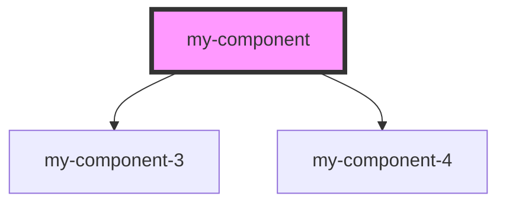

# my-component

<!-- Auto Generated Below -->

## Properties

| Property | Attribute | Description | Type             | Default |
| -------- | --------- | ----------- | ---------------- | ------- |
| `type`   | `type`    |             | `"one" \| "two"` | `"one"` |

## Dependencies

### Depends on

- [my-component-3](../my-component-3)
- [my-component-4](../my-component-4)

### Graph

----------------------------------------------

*Built with [StencilJS](https://stenciljs.com/)*
